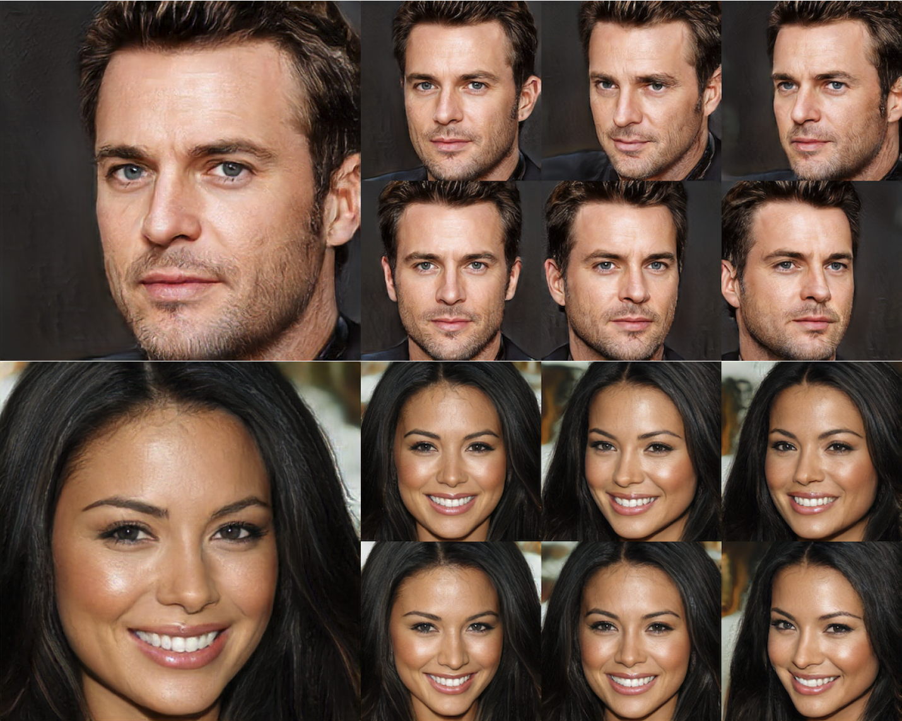

# Multi-View Consistent Generative Adversarial Networks for 3D-aware Image Synthesis</sub>



<!-- > This repository is an official PyTorch implementation of paper:<br> -->
> [Multi-View Consistent Generative Adversarial Networks for 3D-aware Image Synthesis](https://arxiv.org/abs/2204.06307).<br>
> Xuanmeng Zhang, Zhedong Zheng, Daiheng Gao, Bang Zhang, Pan Pan, Yi Yang <br>
> CVPR 2022.

Abstract: *3D-aware image synthesis aims to generate images of objects from multiple views by learning a 3D representation. However, one key challenge remains: 
existing approaches lack geometry constraints, hence usually fail to generate multi-view consistent images. To address this challenge,  we propose  Multi-View Consistent Generative Adversarial Networks (MVCGAN) for high-quality 3D-aware image synthesis with geometry constraints. By leveraging the underlying 3D geometry information of generated images, i.e., depth and camera transformation matrix, we explicitly establish stereo correspondence between views to perform multi-view joint optimization. In particular, we enforce the photometric consistency between pairs of views and integrate a stereo mixup mechanism into the training process, encouraging the model to reason about the correct 3D shape. Besides, we design a two-stage training strategy with feature-level multi-view joint optimization to improve the image quality. Extensive experiments on three datasets demonstrate that MVCGAN achieves the state-of-the-art performance for 3D-aware image synthesis*

Please refer to the [supplementary
video](https://drive.google.com/file/d/1D8qwd4wGh4J2nQxin70dJdjCTdE_tr0I/view?usp=sharing) for more visualization results.


## Getting Started
### Installation
Install dependencies by:
```
pip install -r requirements.txt
```

### Dataset
- Download [CelebAHQ](https://github.com/switchablenorms/CelebAMask-HQ)

- Download [FFHQ](https://github.com/NVlabs/ffhq-dataset) 

- Download [AFHQv2](https://github.com/clovaai/stargan-v2)


## Training
```bash
CUDA_VISIBLE_DEVICES=0,1,2,3,4,5,6,7 python main.py --output_dir celebahq_exp --port 12361 --curriculum CelebAHQ
```
Please modify the configuration file ```curriculms.py``` according to your own model and data config. 

## Rendering
```bash
CUDA_VISIBLE_DEVICES=0 python render_multiview_image.py --path ${CHECKPOINT_PATH} --output_dir render_dir --output_size 512 --curriculum FFHQ
```


## Acknowledgment

Our implementation of MVCGAN is partly based on the following codebases. We gratefully thank the authors for their wonderful works: 
[pi-gan](https://github.com/marcoamonteiro/pi-GAN),
[pytorch_GAN_zoo](https://github.com/facebookresearch/pytorch_GAN_zoo).

## Citation
If you find our code or paper useful, please consider citing:
```
@inproceedings{zhang2022multiview,
  title={Multi-View Consistent Generative Adversarial Networks for 3D-aware Image Synthesis},
  author={Zhang, Xuanmeng and Zheng, Zhedong and Gao, Daiheng and Zhang, Bang and Pan, Pan and Yang, Yi},
  booktitle={Proceedings of the IEEE/CVF Conference on Computer Vision and Pattern Recognition},
  year={2022}
}
```
